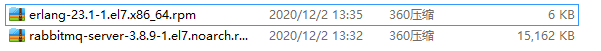

一、rpm 安装RabbitMQ

> RabbitMQ依赖于Erlang、socat，因此要首先安装Erlang与socat

安装包准备：



> 下载地址：
> 
> 1. rabbitmq官网：https://www.rabbitmq.com/install-rpm.html

```
# 1. 安装erlang的依赖包
rpm -ivh 
# 2. socat安装

# 3. 安装RabbitMQ
```

二、docker 安装RabbitMQ

```yml
version: "3.1"
services:
  rabbitmq:
    image: daocloud.io/library/rabbitmq:3.8.5-management
    restart: always
    container_name: rabbitmq
    ports:
      - 5672:5672
      - 15672:15672
    volumes:
      - ./data:/mysoftware/data/rabbitmq
```
