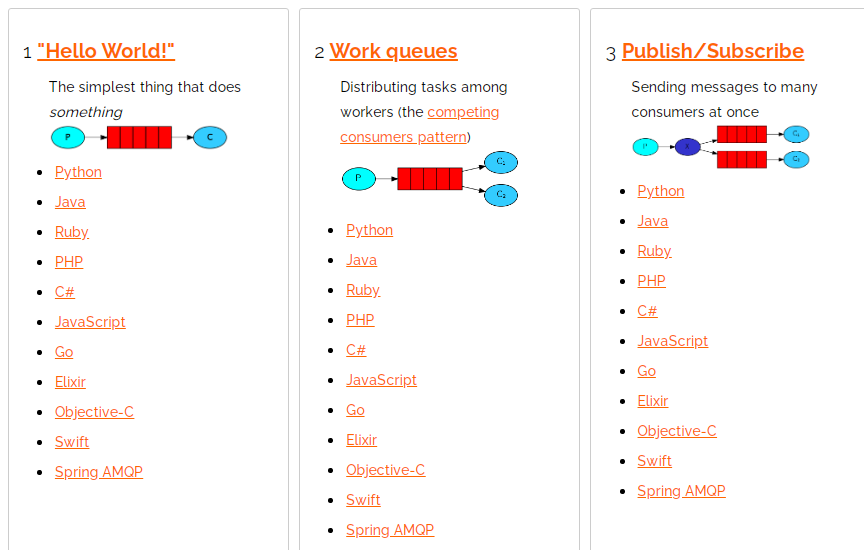

# 一、 简介

## 1. 能解决的问题

> 1. 模块之间的耦合度过高，
> 2. 解决同步通讯

# 二、安装

# 三、架构

```

```


# 四、基本使用

## 4.1 通信方式




## 4.2  java 连接RabbitMQ

### 4.2.1 依赖

```xml
<!-- https://mvnrepository.com/artifact/com.rabbitmq/amqp-client -->
<dependency>
    <groupId>com.rabbitmq</groupId>
    <artifactId>amqp-client</artifactId>
    <version>5.9.0</version>
</dependency>
```

## 4.3 七种模型

# 4.3.1

# 五、整合springboot

# 六、其他