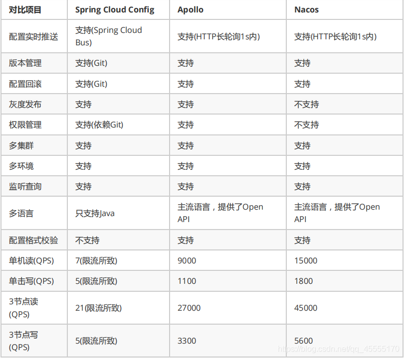

# 一、配置中心

## 1. 配置

> ​        应用程序在启动和运行的时候往往需要读取一些配置信息，配置基本上伴随着应用程序的整个生命周期，比如：数据库连接参数，启动参数等。

### 1.1 配置的特点

> - 配置对于程序是只读的
>   - 程序通过读取配置来改变自己的行为，但是程序不应该去改变配置
> - 配置基本上伴随着应用程序的整个生命周期
>   - 应用在启动时通过读取配置来初始化，在运行时根据配置调整行为。比如：启动时需要读取服务的端口号，系统在运行过程中需要读取定时策略执行定时任务。
> - 配置可以有多种加载方式
>   - 常见的有程序内部hard cord, 配置文件，环境变量，启动参数，基于数据库等
> - 配置需要治理
>   - 同一份程序在不同的环境（开发，测试，生产）、不同的集群（如不同的数据中心）经常需要有不同的配置，所以需要有完善的环境，集群配置管理

## 2. 配置中心

> 在微服务架构中，当系统从一个单体应用，被拆分成分布式系统一个个服务节点后，配置文件也必须跟着迁移（分割），配置文件分散、冗余。
>
> 配置中心将配置从各应用中剥离出来，对配置进行统一管理，应用自身不需要自己去管理配置

### 2.1 配置中心的服务流程


**总得来说，配置中心就是一种统一管理各种应用配置的基础服务组件。**

### 2.2 配置中心的作用

> 配置中心在分布式系统中的作用：


### 2.3 配置中心的特点

> 1、配置项容易读取和修改
> 2、分布式环境下应用配置的可管理性，即提供远程管理配置的能力
> 3、支持对配置的修改的检视以把控风险
> 4、可以查看配置修改的历史记录
> 5、不同部署环境下应用配置的隔离性

### 2.4 不同的配置中心对比

### 2.4.1 Disconf

```bash
# github 网站
https://github.com/knightliao/disconf
```

> 2014 年开源，2016年闭源

### 2.4.2. Spring cloud config

> 

### 2.4.3. Apollo

携程

> 

### 2.4.4. Nacos

阿里

> 


### 2.4.5 对比



# 二、Nacos 

## 1. 简介

> 一个更易于构建云原生应用的动态服务发现、配置管理和服务管理平台。

```bash
# 官网
http://nacos.io https://nacos.io/zh-cn/
```

## 2. 功能

### 2.1 动态配置服务

> - 动态配置服务让您能够以中心化、外部化和动态化的方式管理所有环境的配置。
> - 动态配置消除了配置变更时重新部署应用和服务的需要。
> - 配置中心化管理让实现无状态服务更简单，也让按需弹性扩展服务更容易。

### 2.2 服务发现及管理

> - 动态服务发现对以服务为中心的（例如微服务和云原生）应用架构方式非常关键。
> - Nacos支持DNS-Based和RPC-Based（Dubbo、gRPC）模式的服务发现。
> - Nacos也提供实时健康检查，以防止将请求发往不健康的主机或服务实例。
> - 借助Nacos，您可以更容易地为您的服务实现断路器。

### 2.3 动态DNS服务

> - 通过支持权重路由，动态DNS服务能让您轻松实现中间层负载均衡、更灵活的路由策略、流量控制以及简单数据中心内网的简单DNS解析服务。
> - 动态DNS服务还能让您更容易地实现以DNS协议为基础的服务发现，以消除耦合到厂商私有服务发现API上的风险。

### 2.4 服务和元数据管理

> Nacos能让您从微服务平台建设的视角管理数据中心的所有服务及元数据，包括管理服务的描述，生命周期，服务的静态依赖分析，服务的健康状态，服务的流量管理，路由及安全策略。


## 3. Nacos 配置管理基础

### 3.1 Nacos配置管理模型

> - 通过Nacos配置管理，通过namespace/group/ data Id 能够定位到一个配置集（从大到小）
>   - Namespace 环境
>   - group 工程
>   - dataid 配置文件

#### 命名空间

用于进行租户粒度的配置隔离。不同的命名空间下，可以存在相同的 Group 或 Data ID 的配置。Namespace 的常用场景之一是不同环境的配置的区分隔离，例如开发测试环境和生产环境的资源（如配置、服务）隔离等。

#### 配置

在系统开发过程中，开发者通常会将一些需要变更的参数、变量等从代码中分离出来独立管理，以独立的配置文件的形式存在。目的是让静态的系统工件或者交付物（如 WAR，JAR  包等）更好地和实际的物理运行环境进行适配。配置管理一般包含在系统部署的过程中，由系统管理员或者运维人员完成。配置变更是调整系统运行时的行为的有效手段。

#### 配置管理

系统配置的编辑、存储、分发、变更管理、历史版本管理、变更审计等所有与配置相关的活动。

#### 配置项

一个具体的可配置的参数与其值域，通常以 param-key=param-value 的形式存在。例如我们常配置系统的日志输出级别（logLevel=INFO|WARN|ERROR） 就是一个配置项。

#### 配置集

一组相关或者不相关的配置项的集合称为配置集。在系统中，一个配置文件通常就是一个配置集，包含了系统各个方面的配置。例如，一个配置集可能包含了数据源、线程池、日志级别等配置项。

#### 配置集 ID

Nacos 中的某个配置集的 ID。配置集 ID 是组织划分配置的维度之一。Data ID  通常用于组织划分系统的配置集。一个系统或者应用可以包含多个配置集，每个配置集都可以被一个有意义的名称标识。Data ID 通常采用类 Java  包（如 com.taobao.tc.refund.log.level）的命名规则保证全局唯一性。此命名规则非强制。

#### 配置分组

Nacos 中的一组配置集，是组织配置的维度之一。通过一个有意义的字符串（如 Buy 或 Trade ）对配置集进行分组，从而区分  Data ID 相同的配置集。当您在 Nacos 上创建一个配置时，如果未填写配置分组的名称，则配置分组的名称默认采用  DEFAULT_GROUP 。配置分组的常见场景：不同的应用或组件使用了相同的配置类型，如 database_url 配置和 MQ_topic  配置。

#### 配置快照

Nacos 的客户端 SDK 会在本地生成配置的快照。当客户端无法连接到 Nacos Server  时，可以使用配置快照显示系统的整体容灾能力。配置快照类似于 Git 中的本地  commit，也类似于缓存，会在适当的时机更新，但是并没有缓存过期（expiration）的概念。

### 3.2 命名空间管理

#### 3.2.1 隔离设计

> 隔离不同的环境 dev prop test
>
> 每个用户可以有自己的命名空间

#### 3.2.2 命名空间管理

> gui 修改

### 3.3 配置管理

#### 3.3.1 配置列表

#### 3.3.2 历史版本

#### 3.3.3 监听查询

### 3.4 配置优先级

> 服务名+扩展名> 扩展id[max]>扩展id[min]>共享id

## 4. 用户管理

> 图形用户界面可以修改用户密码，管理员还可以添加和删除用户

配置文件中可修改

```
spring.security.enabled=false
```

## 5. Nacos 配置管理应用于分布式系统

### 5.1 从单体架构到微服务架构

#### 5.1.1 单体架构

> - 模块独立化
> - 整体打包部署
> - 优点
>   - 开发效率高
>   - 容易测试
>   - 容易部署
> - 缺点
>   - 复杂性逐渐变高，可维护性逐渐变差
>   - 版本迭代速度逐渐变慢

#### 5.1.2 微服务架构

> - 完成某一项或者几项的任务
> - 有自己的业务逻辑和数据库
> - 彼此之间互相连接
> - 好处：
>   - 分而治之，职责单一，易于开发、理解和维护，方便团队的拆分和管理
>   - 可伸缩，能够单独的对指定的服务进行伸缩
>   - 局部容易修改，容易替换，容易部署，有利于持续集成和快速迭代
>   - 不会受限于任何技术栈

### 5.2 分布式应用配置管理

> - 用户通过Nacos Server 的控制台集中对多个服务的配置进行管理
> - 各服务统一从Nacos Server 中获取各自的配置，并监听配置的变化