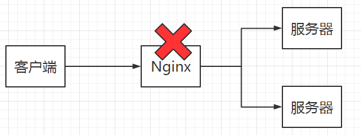

# Nginx介绍

## 一、简单的架构


> 存在的问题
> 
> 1. 客户端到底要将请求发送给哪台服务器
> 2. 如果所有客户端的请求都发送给了一台服务器
> 3. 客户端发送的请求可能是动态申请资源的，也可能是有静态资源

## 二、 引入Nginx 服务器


> 可以解决的问题
> 
> 1. 反向代理
> 2. 负载均衡
> 3. 动静分离

## 三、 介绍

### 1、介绍

> Nginx是俄罗斯人研发的，2004年发布的第一个版本，应对Rambler网站的并发。

> https://baike.baidu.com/item/nginx/3817705?fr=aladdin

### 2、 特点

> 1. 稳定性极强。7*24小时不间断进行
> 2. Nginx提供了非常丰富的配置实例
> 3. 占用内存小，并发能力强
>    - 能承受5万以上的并发

## 四、安装与配置

### 1、安装

### 2、配置

```yml
# 启动用户
user  nginx;
# 启动进程,通常设置成和cpu的数量相等
worker_processes  1;

#全局错误日志及PID文件
error_log  /var/log/nginx/error.log warn;
pid        /var/run/nginx.pid;

#工作模式及连接数上限
events {
    worker_connections  1024;
}


http {
    include       /etc/nginx/mime.types;
    default_type  application/octet-stream;

    log_format  main  '$remote_addr - $remote_user [$time_local] "$request" '
                      '$status $body_bytes_sent "$http_referer" '
                      '"$http_user_agent" "$http_x_forwarded_for"';

    access_log  /var/log/nginx/access.log  main;

    sendfile        on;
    #tcp_nopush     on;

    keepalive_timeout  65;

    #gzip  on;

    include /etc/nginx/conf.d/*.conf;
}
```

```yml
# /etc/nginx/conf.d/default.conf
server {
    # 表示Nginx默认的端口号
    listen       80;
    server_name  localhost;

    #charset koi8-r;
    #access_log  /var/log/nginx/log/host.access.log  main;

    location / {
        root   /usr/share/nginx/html;
        index  index.html index.htm;
    }

    #error_page  404              /404.html;

    # redirect server error pages to the static page /50x.html
    #
    error_page   500 502 503 504  /50x.html;
    location = /50x.html {
        root   /usr/share/nginx/html;
    }

    # proxy the PHP scripts to Apache listening on 127.0.0.1:80
    #
    #location ~ \.php$ {
    #    proxy_pass   http://127.0.0.1;
    #}

    # pass the PHP scripts to FastCGI server listening on 127.0.0.1:9000
    #
    #location ~ \.php$ {
    #    root           html;
    #    fastcgi_pass   127.0.0.1:9000;
    #    fastcgi_index  index.php;
    #    fastcgi_param  SCRIPT_FILENAME  /scripts$fastcgi_script_name;
    #    include        fastcgi_params;
    #}

    # deny access to .htaccess files, if Apache's document root
    # concurs with nginx's one
    #
    #location ~ /\.ht {
    #    deny  all;
    #}
}
```

## 五、 反向代理

### 1、正向代理

> 1. 正向代理服务器由客户端设立
> 2. 客户端了解代理服务器和目标服务器都是谁
> 3. 帮助我们突破访问权限，提高访问的速度，对目标服务器隐藏客户端的ip地址


### 2、 反向代理

> 1. 反向代理服务器器是配置在服务端的。
> 2. 客户端并不知道访问的到底是哪一台服务器
> 3. 达到负载均衡，并且可以服务器真正的ip地址


### 3、 基于Nginx实现反向代理

> 准备目标服务器Tomcat
> 
> 安装Nginx
> 
> 编写Nginx的配置文件，通过Nginx访问到Tomcat服务器

```yml
server{
    listen 80;
    server name localhost;
    location / {
      proxy_pass http://121.4.47.93:8080/;
    }
}
```

### 4、关于Nginx的location路径映射

> 优先级关系
> 
> (location = )>(location /xxx/yyy/zzz)>(location ^~ )>(location ~|~*）>(location /location)>(location /)

```yml
# 1. = 匹配
location = /{
  # 精准匹配， 主机名后面不能带任何的字符串
}

# 2. 通用匹配
location /xxx {
    # 匹配所有以/xxx开头的路径
}

# 3. 正则匹配
location ~ /xxx{
    # 匹配所有以/xxx开头的路径
}

# 4. 匹配开头路径
location ^~ /images/{
    # 匹配所有以/images/开头的路径
}

# 5. 后缀匹配
location ~* \.(jpg|gif|png){
    # 匹配后缀
}
```

## 六、负载均衡

> Nginx为我们默认提供了三种负载均衡的策略
> 
> 1. 轮询:
>    
>    将客户端发起的请求，平均的分配给每一台服务器
> 
> 2. 权重
>    
>    会将客户端的请求，根据服务器权重值的不同，分配不同的数量
> 
> 3. ip_hash
>    
>    基于发起请求客户端的ip地址不同，他始终会将请求发送到指定的服务器上。

### 1. 轮询

> 配置文件

```
upstream 名字 {
    server ip:port;
    server ip:port;
    ...
}
server{
    location / {
        proxy_pass: http://名字/;
    }
}
```

### 2. 权重

> 配置文件

```yml
upstream 名字 {
    server ip:port weight=比例权重;
    server ip:port weight=比例权重;
    ...
}
server{
    location / {
        proxy_pass: http://名字/;
    }
}
```

### 3. ip_hash

> 配置

```json
upstream 名字 {
    ip_hash;
    server ip:port;
    server ip:port;
    ...
}
server{
    location / {
        proxy_pass: http://名字/;
    }
}
```

## 七、动静分离

> Nginx的并发能力：
> 
> ​    worker_processes* worker_connections /(2|4)
> 
> ​    动态资源除以4， 静态资源除以2
> 
> 提升并发能力更快的给用户响应

### 1.  动态资源搭理

```
location / {
      proxy_pass http://121.4.47.93:8080/;
    }
```

### 2. 静态资源代理

```yml
# 配置如下
location / {
    root 静态资源路径；
    index 默认访问路径下的什么资源
    autoindex on; #以列表的方式访问静态资源 
}

location /html {
    root /data;
    index index.html
}

location /img {
    root /data;
    autoindex on;
}
```

## 八、集群搭建

### 1. 引言

> 1. 单点故障
> 2. 统一ip地址 虚拟地址映射
> 3. keepalive 监听




### 2. 搭建过程