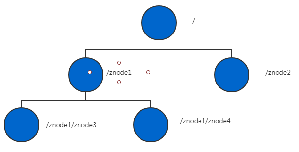

# Zookeeper

## 一、zookeeper 简介

### 1.1 简介

> ZooKeeper是一个[分布式](https://baike.baidu.com/item/分布式/19276232)的，开放源码的[分布式应用程序](https://baike.baidu.com/item/分布式应用程序/9854429)协调服务，是[Google](https://baike.baidu.com/item/Google)的Chubby一个[开源](https://baike.baidu.com/item/开源/246339)的实现，是Hadoop和[Hbase](https://baike.baidu.com/item/Hbase/7670213)的重要组件。它是一个为分布式应用提供一致性服务的软件，提供的功能包括：配置维护、域名服务、分布式同步、组服务等。
> 
> ZooKeeper的目标就是封装好复杂易出错的关键服务，将简单易用的接口和性能高效、功能稳定的系统提供给用户。
> 
> ZooKeeper包含一个简单的原语集，提供Java和C的接口。
> 
> ZooKeeper代码版本中，提供了分布式独享锁、选举、队列的接口，代码在$zookeeper_home\src\recipes。其中分布锁和队列有[Java](https://baike.baidu.com/item/Java/85979)和C两个版本，选举只有Java版本。

### 1.2  原理

> ZooKeeper是以Fast Paxos算法为基础的，[Paxos 算法](https://baike.baidu.com/item/Paxos 算法)存在[活锁](https://baike.baidu.com/item/活锁)的问题，即当有多个[proposer](https://baike.baidu.com/item/proposer)交错提交时，有可能互相排斥导致没有一个proposer能提交成功，而Fast Paxos做了一些优化，通过选举产生一个leader (领导者)，只有leader才能提交proposer，具体算法可见Fast Paxos。因此，要想弄懂ZooKeeper首先得对Fast Paxos有所了解。
> 
> ZooKeeper的基本运转流程：
> 
> 1、选举Leader。
> 
> 2、同步数据。
> 
> 3、选举Leader过程中算法有很多，但要达到的选举标准是一致的。
> 
> 4、Leader要具有最高的执行ID，类似root权限。
> 
> 5、集群中大多数的机器得到响应并接受选出的Leader。

### 1.3 特点

#### 1.3.1 单机特点

> 1. ZooKeeper的数据结构与Unix文件系统很类似，整体上可以看到一棵树，每个节点称作一个ZNode.每个Znode默认能够存储<b>1MB</b>的数据。每个ZNode都可以通过其路径唯一标识。

#### 1.3.2 集群特点

> 1. 一个领导者(Leader),多个(Follower)组成的集群
> 2. 集群中只要有半数以上的节点存活，Zookeeper集群就能正常服务
> 3. 各个节点之间保存同一份数据，无论连接到哪个Server,数据都是一致的
> 4. 更新请求顺序进行，来自同一客户端的更新请求按其发送顺序依次执行
> 5. 数据更新的原子性，一次数据更新要么成功，要么失败
> 6. 实时性，在一定范围内，Client能读到最新的更新数据